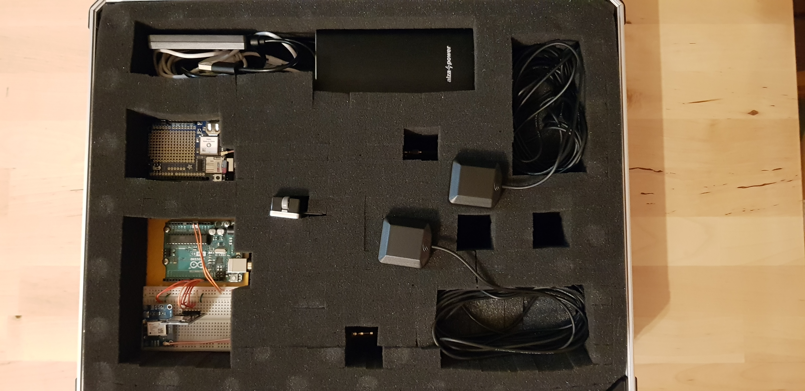
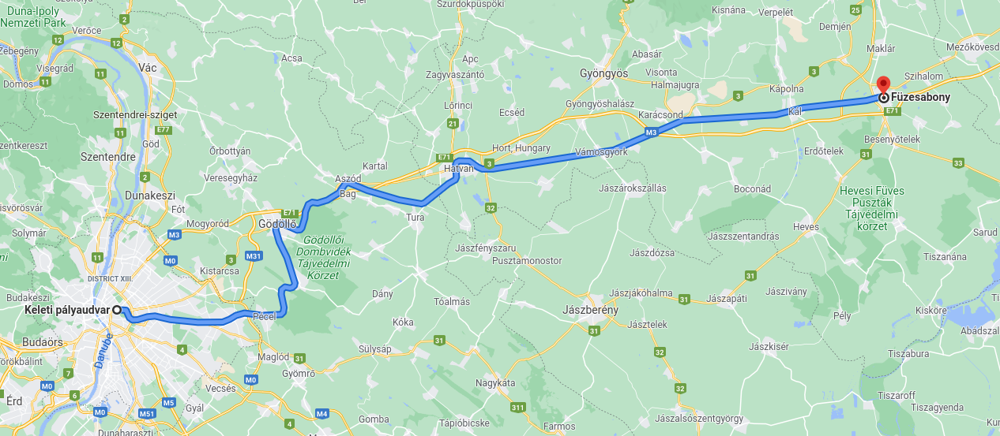

# Train route profile recording with GNSS technology based on ARDUINO platform

## Project target

Develop GNSS recording tools based on the ARDUINO platform to record train route profiles. Acquired data can be used for later research and investigation purposes.

| Dir                          | Content                                                           |
|------------------------------|-------------------------------------------------------------------|
| ARDUINO_GNSS_PMTK_NEOGPS     | ARDUINO program for the MTK 3339 receiver with NeoGPS library     |
| ARDUINO_GNSS_PMTK_TINYGPSPLUS| ARDUINO program for the MTK 3339 receiver with TinyGPSPlus library|
| ARDUIUNO_GNSS_UBX            | ARDUINO program for the u-blox M6N receiver                       |
| Article                      | Article LaTeX file                                                |
| GNSS track data              | Python script for route profile analysis                          |
| GNSS track data - article    | Python script for generating graphs for the article               |

## Equipment

- iPhone 11 Pro
- ARDUINO UNO + u-blox M8N
- ARDUINO UNO + MTK 3339

## Test recordings

Test recording between Budapest-Keleti and Füzesabony available.
Additional static and dynamic comparison measurement data available.

